

PANDUAN RESPONDEN &middot; SENSUS EKONOMI 2026

<h1>Cara Mengisi Survei SIBSTR Triwulanan</h1>

Survei Industri Besar dan Sedang Triwulanan &mdash; BPS Kota Batam

## Ringkasan Alur

1. **Akses Tautan** &mdash; buka `s.bps.go.id/sibstr_tw`
2. **Masuk atau Daftar Akun**
3. **Pilih Periode Triwulanan**
4. **Isi Blok I&ndash;VI** lalu selesaikan survei

## Langkah 1 &mdash; Akses Tautan Survei

Buka tautan pendek berikut dari peramban (browser) HP atau komputer. Tautan akan otomatis mengarahkan ke halaman survei SIBSTR di DataKita &mdash; tidak perlu memasang aplikasi tambahan.

Tautan pendek

s.bps.go.id/sibstr_tw

&rarr;

Diarahkan otomatis ke

datakita.angkabatam.id/survei/sibstr

## Langkah 2 &mdash; Masuk atau Daftar Akun

Akun diperlukan agar isian tersimpan dan dapat dilanjutkan kapan saja.

### Sudah punya akun &mdash; Masuk

<figure>
  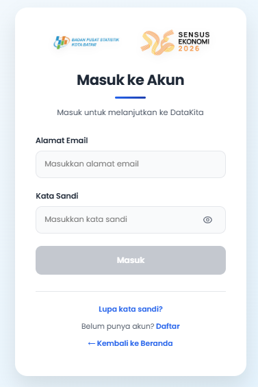
  <figcaption>Halaman <b>Masuk ke Akun</b></figcaption>
</figure>

Isi **Alamat Email** dan **Kata Sandi**, lalu tekan tombol **Masuk**. Jika lupa kata sandi, gunakan tautan **Lupa kata sandi?** di bawah tombol.

### Belum punya akun &mdash; Daftar

<figure>
  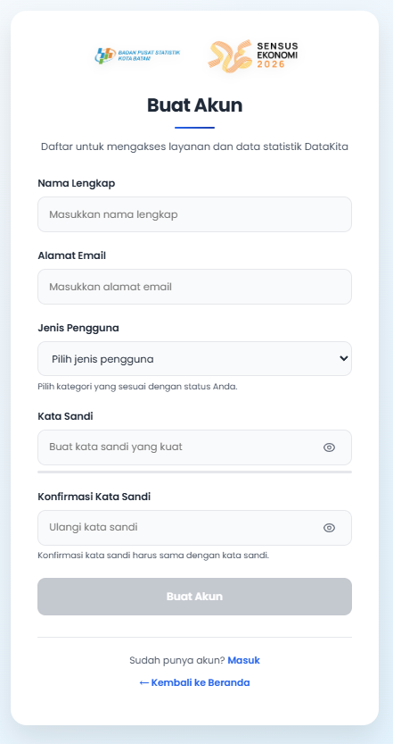
  <figcaption>Halaman <b>Buat Akun</b></figcaption>
</figure>

Lengkapi kelima kolom berikut, lalu tekan **Buat Akun**:

1Nama Lengkap

2Alamat Email

3Jenis Pengguna

4Kata Sandi

5Konfirmasi Kata Sandi

## Langkah 3 &mdash; Pilih Jenis dan Periode Survei

<figure>
  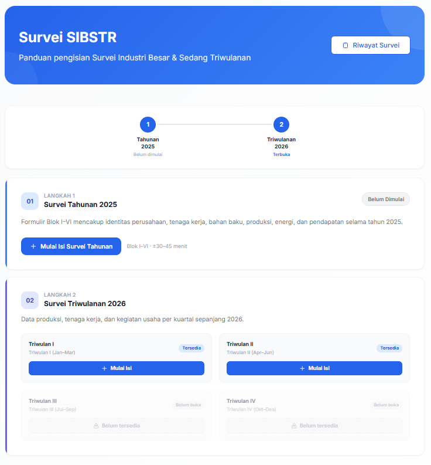
  <figcaption>Dashboard <b>Survei SIBSTR</b></figcaption>
</figure>

Dashboard menampilkan dua tahap: **Langkah 1 &middot; Survei Tahunan 2025** dan **Langkah 2 &middot; Survei Triwulanan 2026**. Untuk isian triwulanan, pilih kartu triwulan yang berstatus Tersedia lalu tekan **+ Mulai Isi**. Triwulan yang berstatus Belum buka belum dapat diisi.

## Langkah 4 &mdash; Isi Formulir Blok I&ndash;VI

Formulir terdiri dari enam blok yang diisi berurutan. Blok IIIA dan pilihan Industri/Non-Industri pada Blok IIIB **menyesuaikan otomatis** berdasarkan KBLI (2 digit) perusahaan &mdash; Anda cukup mengikuti blok yang ditampilkan sistem.

  Blok I&rarr;
  Blok II&rarr;
  KBLI 10&ndash;33?

  YaIIIA + IIIB Industri
  TidakIIIB Non-Industri
  &rarr;Blok V&rarr;Blok VI

Setiap halaman blok menampilkan pita hijau **Tersimpan otomatis** &mdash; isian tersimpan setiap saat, sehingga aman berpindah halaman kapan pun.

### Blok I &mdash; Keterangan Umum &amp; Legalisasi Perusahaan

<figure>
  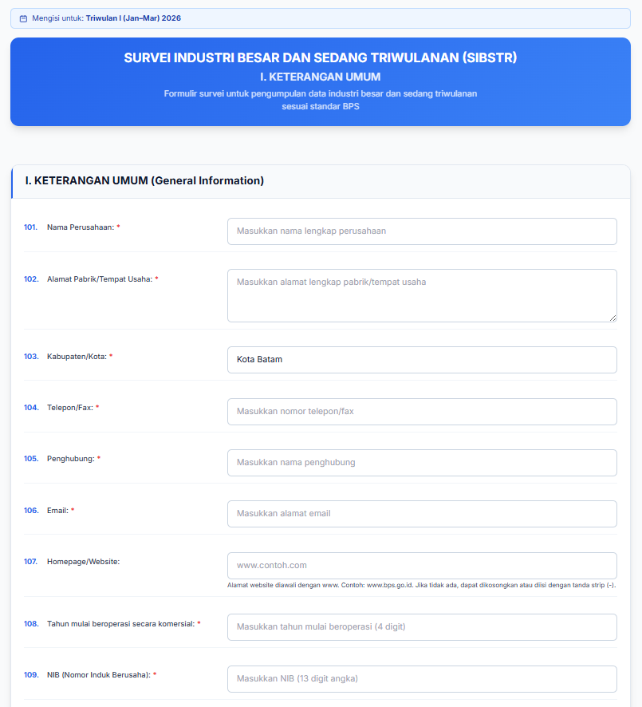
  <figcaption>Blok I &middot; <b>I. Keterangan Umum</b></figcaption>
</figure>

101Nama Perusahaan

102Alamat Pabrik / Tempat Usaha

103Kabupaten / Kota

104Telepon / Fax

105Penghubung

106Email

107Homepage / Website <i>(opsional, isi "-" jika tidak ada)</i>

108Tahun mulai beroperasi secara komersial

109NIB &mdash; Nomor Induk Berusaha (13 digit)

### Blok II &mdash; Pendahuluan

<figure>
  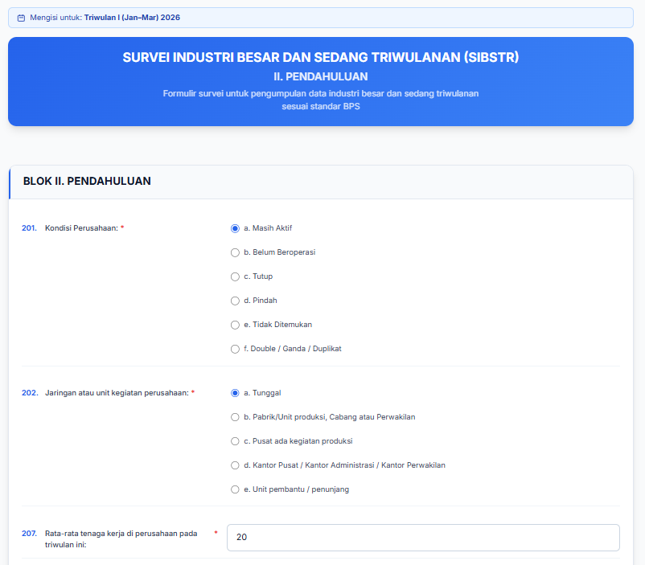
  <figcaption>Blok II &middot; <b>Pendahuluan</b></figcaption>
</figure>

201<b>Kondisi Perusahaan</b> &mdash; Masih Aktif / Belum Beroperasi / Tutup / Pindah / Tidak Ditemukan / Double-Ganda-Duplikat

202<b>Jaringan atau unit kegiatan perusahaan</b> &mdash; Tunggal / Pabrik-Unit Produksi-Cabang / Pusat dengan Kegiatan Produksi / Kantor Pusat-Administrasi-Perwakilan / Unit Pembantu-Penunjang

207<b>Rata-rata tenaga kerja</b> di perusahaan pada triwulan ini

### Blok IIIA &mdash; Kondisi Perekonomian (Pelaku Usaha)

Blok ini <b>hanya muncul</b> jika KBLI 2 digit perusahaan termasuk <b>10&ndash;33 (Industri Pengolahan)</b>. Jika tidak, sistem melewatinya secara otomatis dan langsung menuju Blok IIIB.

<figure>
  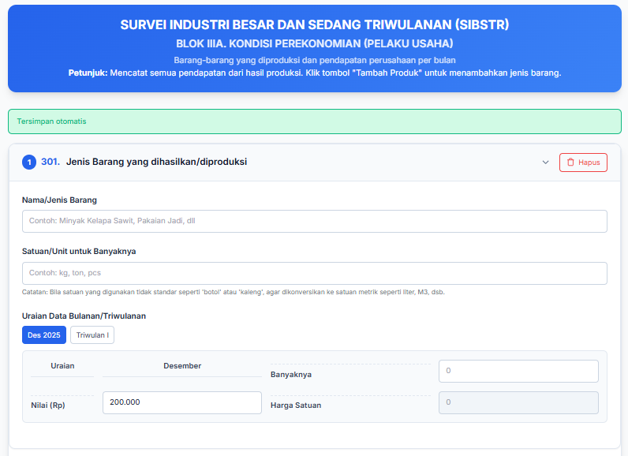
  <figcaption>Blok IIIA &middot; <b>Kondisi Perekonomian (Pelaku Usaha)</b></figcaption>
</figure>

Untuk setiap **301 &middot; Jenis Barang yang Dihasilkan/Diproduksi**, isi Nama/Jenis Barang, Satuan/Unit untuk Banyaknya, lalu Banyaknya, Nilai (Rp), dan Harga Satuan per bulan dalam triwulan berjalan. Gunakan tombol **Tambah Produk** bila ada lebih dari satu jenis barang.

### Blok IIIB &mdash; Industri / Non-Industri

Hanya <b>salah satu</b> versi berikut yang tampil &mdash; sistem menentukannya otomatis dari KBLI perusahaan Anda. Keduanya memuat empat sub-bagian yang sama: <b>Pendapatan Perusahaan</b>, <b>Persediaan (Inventori)</b>, <b>Item Pengeluaran Perusahaan</b>, dan <b>Ekspor Impor Luar Negeri</b>.

<figure>
  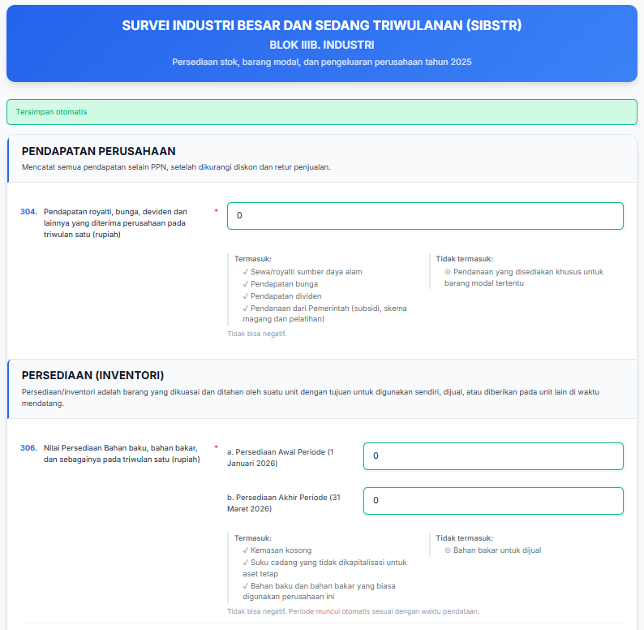
  <figcaption>Jika Industri &middot; Blok IIIB &middot; <b>Pendapatan Perusahaan &amp; Persediaan</b></figcaption>
</figure>

304Pendapatan royalti, bunga, dividen, dan lainnya pada triwulan berjalan (rupiah)

306Nilai Persediaan Bahan Baku &amp; Bahan Bakar &mdash; Persediaan Awal Periode dan Persediaan Akhir Periode (rupiah)

<figure>
  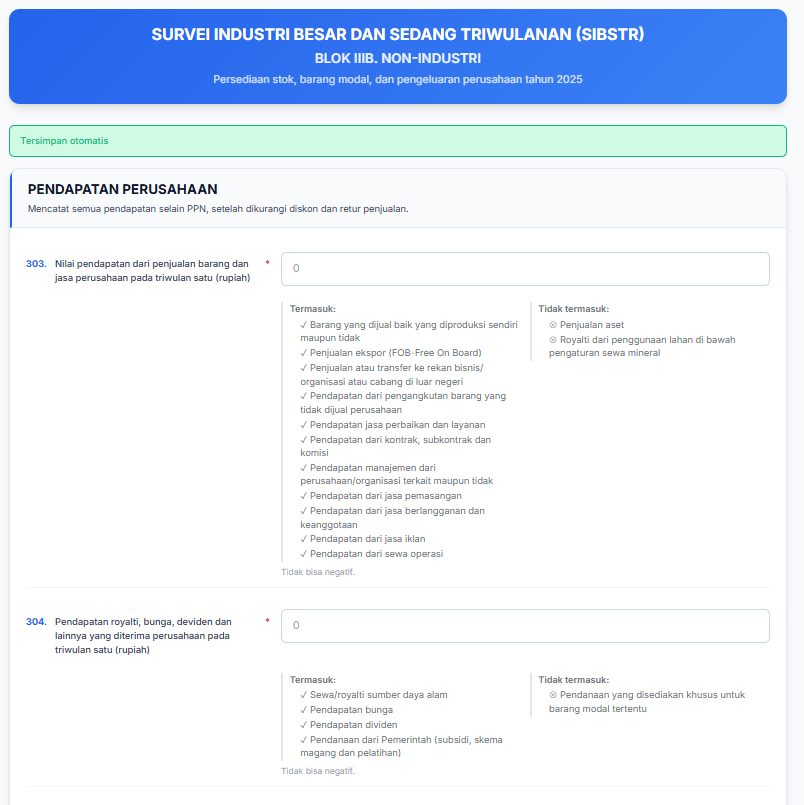
  <figcaption>Jika Non-Industri &middot; Blok IIIB &middot; <b>Pendapatan Perusahaan</b></figcaption>
</figure>

303Nilai pendapatan dari penjualan barang dan jasa perusahaan pada triwulan berjalan (rupiah) &mdash; setelah dikurangi diskon dan retur penjualan

304Pendapatan royalti, bunga, dividen, dan lainnya pada triwulan berjalan (rupiah)

Nilai tidak boleh negatif; kolom periode pada bagian Persediaan muncul otomatis sesuai waktu pendataan.

### Blok V &mdash; Kondisi dan Prospek Usaha

<figure>
  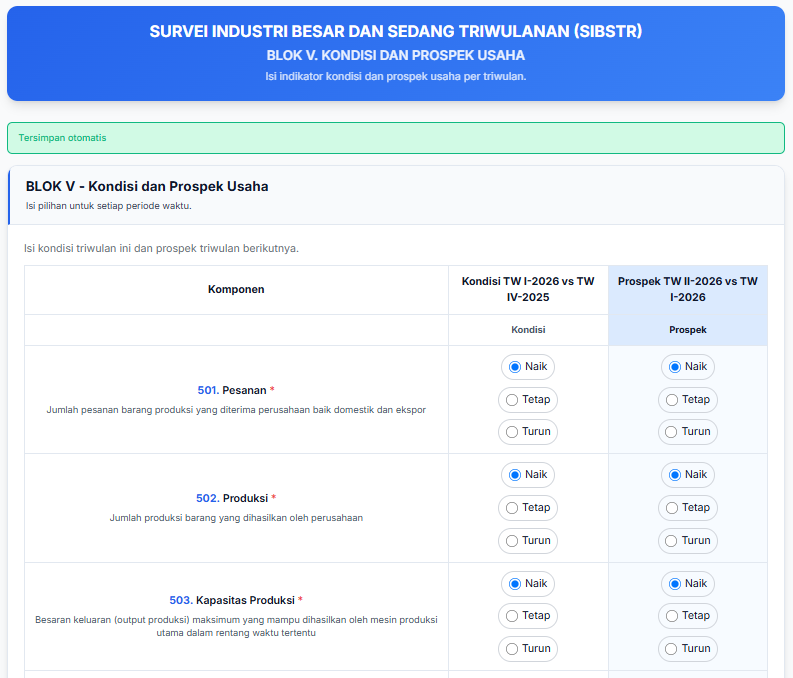
  <figcaption>Blok V &middot; <b>Kondisi dan Prospek Usaha</b></figcaption>
</figure>

Untuk setiap komponen (Pesanan, Produksi, Kapasitas Produksi, dan seterusnya), pilih **Naik / Tetap / Turun** pada dua kolom:

KondisiTriwulan ini dibanding triwulan lalu

ProspekTriwulan depan dibanding triwulan ini

### Blok VI &mdash; Catatan

<figure>
  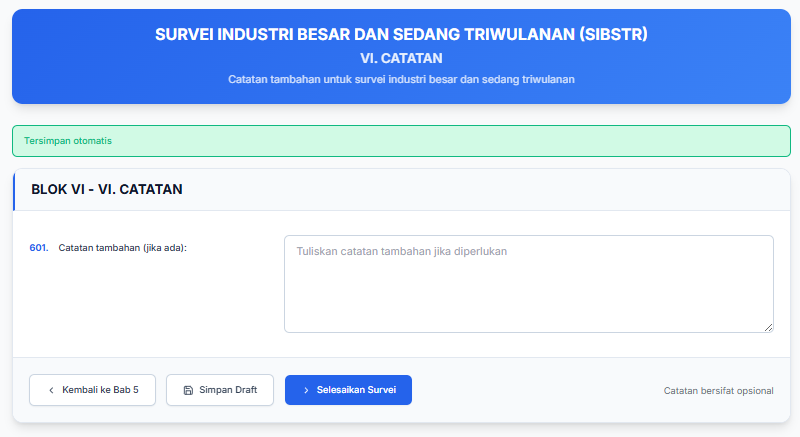
  <figcaption>Blok VI &middot; <b>Catatan</b></figcaption>
</figure>

**601 &middot; Catatan tambahan** bersifat opsional &mdash; isi bila ada kondisi khusus yang perlu dijelaskan. Tiga tombol tersedia di bagian bawah:

&lsaquo;Kembali ke Bab 5

&#128190;Simpan Draft

&rsaquo;<b>Selesaikan Survei</b>

## Langkah 5 &mdash; Survei Selesai

<figure class="figure-narrow">
  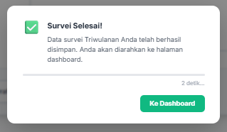
  <figcaption>Konfirmasi <b>Survei Selesai!</b></figcaption>
</figure>

Setelah menekan **Selesaikan Survei**, muncul konfirmasi bahwa data survei triwulanan telah tersimpan, lalu sistem mengarahkan otomatis ke halaman dashboard.

## Yang Perlu Diingat

<h3>Tersimpan otomatis</h3>
Setiap isian langsung tersimpan &mdash; aman berpindah halaman tanpa takut kehilangan data.

<h3>Lanjut kapan saja</h3>
Survei dapat ditinggalkan dan dilanjutkan lagi lewat dashboard atau menu Riwayat Survei.

<h3>Ikuti urutan blok</h3>
Blok IIIA dan pilihan Industri/Non-Industri pada Blok IIIB menyesuaikan otomatis &mdash; cukup isi sesuai yang ditampilkan.

<h3>Butuh bantuan?</h3>
Hubungi BPS Kota Batam melalui kontak penghubung yang tertera pada undangan survei.

